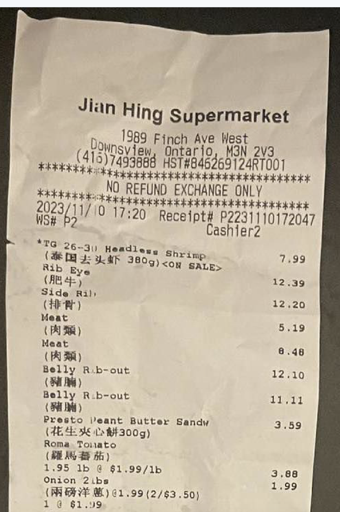
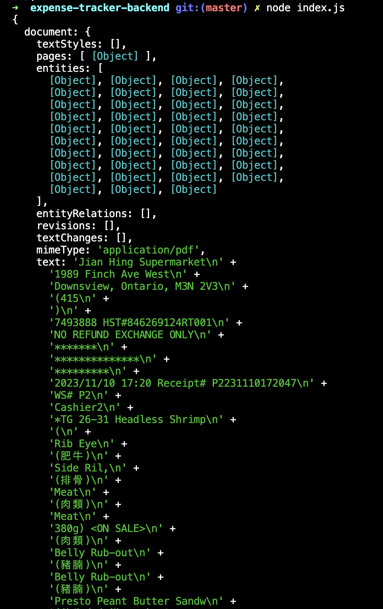

# Expense Tracker 0.0.1

### Inspiration

I am currently exploring solutions to efficiently track my grocery expenses by automating the process of uploading a receipt and saving the extracted data automatically, eliminating the need for manual entry.

I attempted to find a cost-free method to upload my receipts and leverage AI capabilities for automated processing. Unfortunately, all the available applications offering this service come with a fee for uploading receipts.

Therefore, I decided to create a Proof of Concept utilizing Google Cloud Document AI to upload and process my receipts, making use of the remaining $300 in credits to track my expenses.

### POC features

1. We can use the API google cloud via Node.js to process custom processor

### Usage

1. Create a Document AI processor
2. Supply environment .env.example
3. Replace the receipt.pdf with your image file
4. node index.js

### Screenshots

